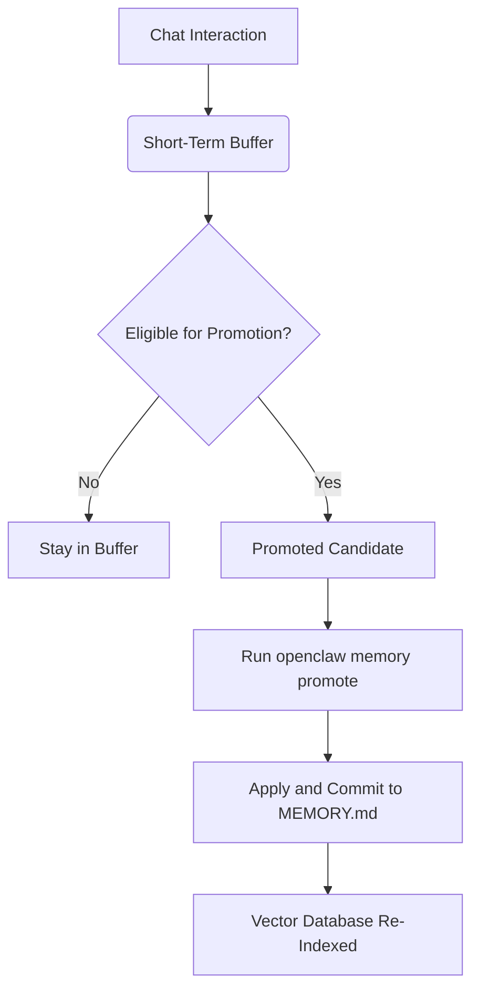

# OpenClaw Memory & Recall Reference

OpenClaw features a mature semantic memory layer designed to manage short-term and long-term recall, enabling agents to build persistent context across chats and sessions.

## Table of Contents

- [Memory Subsystem](#memory-subsystem)
- [Configuration](#configuration)
- [CLI Reference](#cli-reference)
- [Knowledge Wiki (MEMORY.md)](#knowledge-wiki-memorymd)
- [Memory Promotion Flow](#memory-promotion-flow)
- [Troubleshooting](#troubleshooting)

---

## Memory Subsystem

The memory layer operates using the core memory plugin (`memory-core`), which integrates a local/remote vector store (default: LanceDB/SQLite-based) with embedding models to run semantic searches.

Memory is divided into three tiers:
1. **Short-Term Memory:** Active session context, recent user/agent turns.
2. **Long-Term Memory (Recall):** Semantically searchable facts and interactions.
3. **Structured Knowledge (Memory Wiki):** Explicitly curated markdown notes (`MEMORY.md`).

---

## Configuration

Memory settings are managed under `agents.defaults.memorySearch` in `~/.openclaw/openclaw.json`.

```json5
{
  agents: {
    defaults: {
      memorySearch: {
        maxResults: 5,           // Maximum search hits to inject into context
        minScore: 0.7,           // Minimum cosine similarity score threshold
      },
    },
  },
}
```

---

## CLI Reference

All memory operations are managed via the `openclaw memory` namespace. Use the `--agent <id>` flag to specify a target agent.

### Status & Diagnostics

```bash
# Check memory plugin health and settings
openclaw memory status

# Perform a deep probe on the vector store and embedding provider
openclaw memory status --deep

# Repair stale recall locks or corrupt promotion metadata
openclaw memory status --fix
```

### Search & Recall

```bash
# Query the semantic memory pool manually
openclaw memory search "What is the primary server IP?"

# Custom search configurations
openclaw memory search "API key details" --max-results 3 --min-score 0.8
```

### Indexing & Maintenance

```bash
# Refresh semantic index from source files
openclaw memory index

# Force rebuild the entire vector store index from raw documents
openclaw memory index --force
```

### Promotion (Short-term to Long-term)

```bash
# Preview candidates eligible for long-term memory promotion
openclaw memory promote

# Commit promotion candidates to the persistent MEMORY.md wiki
openclaw memory promote --apply

# Explains the exact scoring breakdown for a specific candidate
openclaw memory promote-explain "user requested docker deploy configuration"
```

---

## Knowledge Wiki (MEMORY.md)

OpenClaw supports a Markdown-first structured knowledge base stored at the root of the workspace or agent home:
* **File:** `MEMORY.md`
* **Syntax:** GFM (GitHub Flavored Markdown) with wikilinks.
* **Auto-Ingestion:** The indexing daemon automatically watches and ingests changes made to `MEMORY.md` so that the agent's semantic search context stays up-to-date.

---

## Memory Promotion Flow



---

## Troubleshooting

### Memory Queries Returning Low-Quality Matches
- Ensure your embedding provider is correctly authenticated: `openclaw models status --probe`
- Check `minScore` threshold in `openclaw.json`. If it's too high, valid matches are discarded.
- Run `openclaw memory index --force` to rebuild clean vector indexes from files.

### Memory Locks or Latency Errors
- Run `openclaw memory status --fix` to clear stale locks.
- Ensure the gateway is not blocked by heavy concurrent execution tasks.
